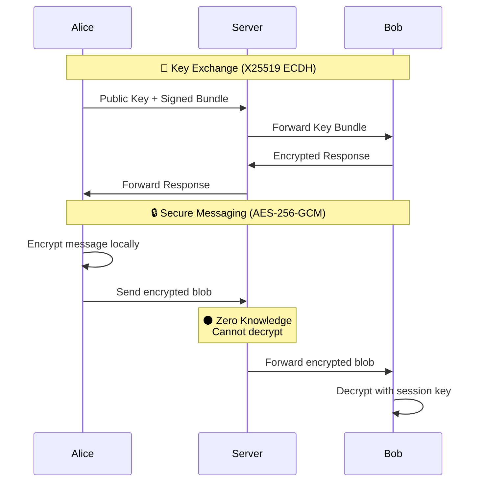

<p align="center">
  
  
  
  
</p>

<h1 align="center">
  👻 Phantom Messenger
</h1>

<p align="center">
  <strong>Secure • Anonymous • Ephemeral</strong>
</p>

<p align="center">
  A zero-knowledge, end-to-end encrypted messaging platform with disposable identities.<br/>
  Your messages. Your privacy. No compromises.
</p>

<p align="center">
  
  
  
  
</p>

---

## ✨ Features

<table>
<tr>
<td width="50%">

### 🔐 Military-Grade Security
- **AES-256-GCM** encryption for all messages
- **X25519 ECDH** key exchange
- **Perfect Forward Secrecy** (PFS)
- **HMAC-SHA256** message integrity
- **16-bit** additional security layer

</td>
<td width="50%">

### 👤 True Anonymity
- **Zero-Knowledge Architecture** - server can't read messages
- **Disposable Identities** - create & destroy on demand
- **No Metadata/Logs** - complete privacy
- **Invitation-Only** access system

</td>
</tr>
<tr>
<td width="50%">

### 💬 Modern Messaging
- **Real-time** WebSocket communication
- **Burn After Reading** messages
- **Typing Indicators**
- **Media Sharing** (encrypted)
- **Message Sync** across devices

</td>
<td width="50%">

### 🌐 Cross-Platform
- **Web** - Progressive Web App
- **iOS** - React Native
- **Android** - React Native
- **Synchronized** across all platforms

</td>
</tr>
</table>

---

## 🏗️ Architecture

```
phantom-messenger/
├── 📦 packages/
│   ├── crypto/          # Core cryptographic library
│   │   ├── aes.ts       # AES-256-GCM encryption
│   │   ├── keyExchange.ts # X25519 ECDH + HKDF
│   │   ├── identity.ts  # Disposable identity system
│   │   └── message.ts   # Message encryption/signing
│   │
│   └── shared/          # Shared types & utilities
│       ├── types.ts     # TypeScript interfaces
│       └── utils.ts     # Common utilities
│
├── 🚀 apps/
│   ├── server/          # WebSocket backend
│   │   ├── server.ts    # Express + WS server
│   │   ├── connectionManager.ts
│   │   ├── messageHandler.ts
│   │   └── rateLimiter.ts
│   │
│   ├── web/             # React web client
│   │   ├── components/  # UI components
│   │   ├── services/    # WebSocket, crypto
│   │   └── store/       # Zustand state
│   │
│   └── mobile/          # React Native app
│
└── 📚 docs/             # Documentation
```

---

## 🔐 Security Flow



---

## 🚀 Quick Start

### Prerequisites

- Node.js ≥ 18.0.0
- npm ≥ 10.0.0

### Installation

```bash
# Clone the repository
git clone https://github.com/your-username/phantom-messenger.git
cd phantom-messenger

# Install dependencies
npm install

# Build all packages
npm run build
```

### Development

```bash
# Start all services (server + web)
npm run dev

# Or run individually:
npm run server:dev    # Backend on ws://localhost:8080
npm run web:dev       # Frontend on http://localhost:3000
```

### Testing

```bash
# Run all tests
npm test

# Security-specific tests
npm run test:security

# Crypto library tests
npm test --workspace=@phantom/crypto
```

---

## 📱 Screenshots

<p align="center">
  <i>Coming soon...</i>
</p>

---

## 🛡️ Security Architecture

### Encryption Layers

| Layer | Algorithm | Purpose |
|-------|-----------|---------|
| 1 | X25519 ECDH | Key Exchange |
| 2 | HKDF-SHA256 | Key Derivation |
| 3 | AES-256-GCM | Message Encryption |
| 4 | HMAC-SHA256 | Integrity Verification |
| 5 | 16-bit Layer | Additional Security |

### Zero-Knowledge Guarantees

- ✅ Server **never** sees plaintext messages
- ✅ Server **cannot** decrypt stored messages
- ✅ No message content logging
- ✅ No metadata collection
- ✅ Cryptographic authentication only

### Disposable Identity System

```typescript
// Generate new identity
const identity = await generateIdentity();

// Your identity is a random 256-bit value
// No link to real-world identity
// Can be permanently destroyed

await destroyIdentity(identity);
// All traces wiped - unrecoverable
```

---

## 🎟️ Invitation System

Phantom uses an **invite-only** access model:

1. 🎫 **Generate** - Authenticated users create secure invitation codes
2. 📤 **Share** - Codes include encrypted metadata
3. ☝️ **Single-Use** - Each invitation works once
4. ⏰ **Expirable** - Auto-expire after configurable time
5. 🚫 **Revocable** - Cancel invitations before use

---

## 🗺️ Roadmap

- [x] Core encryption library
- [x] WebSocket server
- [x] Web client
- [ ] Voice messages
- [ ] File sharing
- [ ] Group chats
- [ ] Push notifications
- [ ] Mobile apps (iOS/Android)
- [ ] Desktop apps (Electron)

---

## 🤝 Contributing

Contributions are welcome! Please read our [Contributing Guide](./docs/CONTRIBUTING.md) first.

```bash
# Fork the repo
# Create your feature branch
git checkout -b feature/amazing-feature

# Commit your changes
git commit -m 'Add amazing feature'

# Push to the branch
git push origin feature/amazing-feature

# Open a Pull Request
```

---

## 📜 License

This project is licensed under the **MIT License** - see the [LICENSE](./LICENSE) file for details.

---

## ⚠️ Disclaimer

This software is provided for **legitimate privacy and security purposes**. Users are responsible for complying with all applicable laws and regulations in their jurisdiction.

---

<p align="center">
  <strong>Built with 🖤 for privacy advocates</strong>
</p>

<p align="center">
  <sub>If you find this project useful, please consider giving it a ⭐</sub>
</p>
